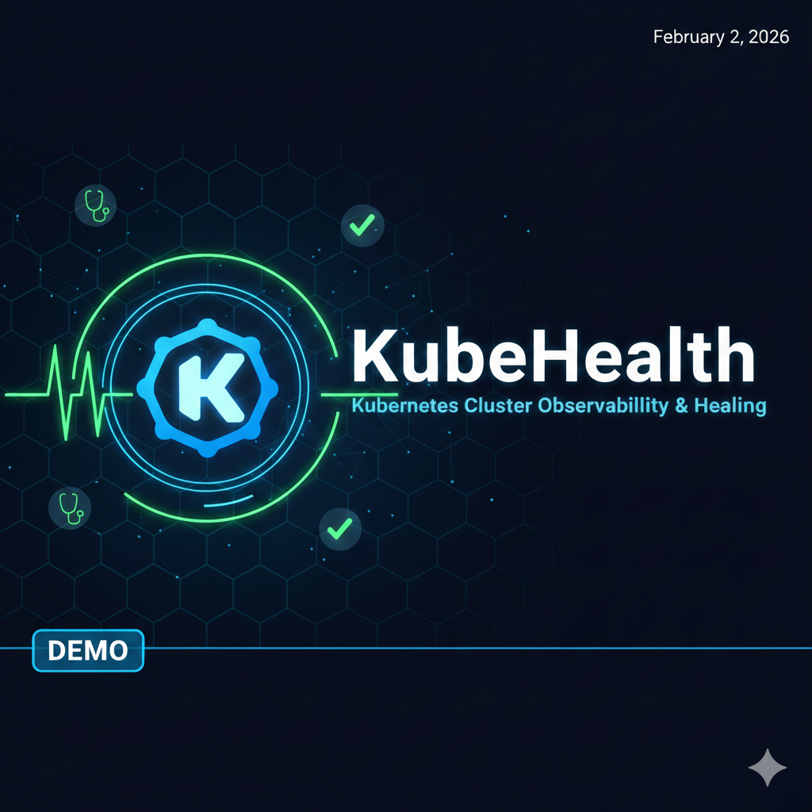

# KubeHealth 🩺
*A minimal Kubernetes self-healing controller written in Go*

## What it does
**KubeHealth** is a lightweight Kubernetes controller that watches pods in a single namespace and automatically recovers pods stuck in **CrashLoopBackOff**. It uses the Kubernetes `client-go` watch API to detect failures in real time and deletes unhealthy pods so their owning controller (Deployment / ReplicaSet) can recreate them. 

The service runs in-cluster using namespace-scoped RBAC, exposes a `/healthz` endpoint, and shuts down gracefully on SIGTERM.

---

## Architecture


```text
+-----------------------------+
|       KubeHealth Pod        |
|                             |
|       Go Controller         |
|  - client-go Watch          |
|  - CrashLoopBackOff detect  |
|  - Pod delete (restart)     |
|  - /healthz HTTP endpoint   |
+-------------+---------------+
              |
              | watch / delete
              v
+-----------------------------+
|    Kubernetes API Server    |
+--------------+--------------+
               |
               | Recreates Pod
               v
     +-------------------+
     | CrashLoopBackOff  |
     |      Pod          |
     +-------------------+
```
---

## Demo Video

[](https://drive.google.com/file/d/1U0eDJD1W5hyEHYYjXSj9NsHiBn8uPc7H/preview)

Direct link: https://drive.google.com/file/d/1U0eDJD1W5hyEHYYjXSj9NsHiBn8uPc7H/view?usp=sharing

## Setup

### Prerequisites

* **Docker**
* **kubectl**
* **kind** (Kubernetes in Docker)

### 1. Create Cluster

Start a local Kubernetes cluster using `kind`:

```bash
kind create cluster --name kubehealth

```

### 2. Build and Load Image

Build the Go binary into a container and sideload it into the cluster nodes to skip the need for a container registry:

```bash
# Build the image
docker build -t kubehealth:dev .

# Load into kind
kind load docker-image kubehealth:dev --name kubehealth

```

### 3. Deploy Controller

Apply the manifest files (ServiceAccount, Role, RoleBinding, and Deployment):

```bash
kubectl apply -f deploy/

```

**Verify the controller is running:**

```bash
kubectl get pods -l app=kubehealth
kubectl logs -l app=kubehealth -f

```

### 4) Deploy crashing workload

```bash
kubectl apply -f crash.yaml

```

### 5. Observe Self-Healing

Open two terminal windows to watch the interaction:

* **Terminal A (Pod Status):** `kubectl get pods -w -l app=crash-demo`
* **Terminal B (Controller Logs):** `kubectl logs -l app=kubehealth -f`

**Expected Behavior:**

1. The `crash-demo` pod enters `CrashLoopBackOff`.
2. KubeHealth logs: `Detected CrashLoopBackOff in pod crash-demo. Deleting...`
3. KubeHealth deletes the pod, and the Deployment controller automatically recreates it.

---

## RBAC & Security

KubeHealth follows the principle of **Least Privilege** using a namespace-scoped `ServiceAccount`.

* **Permissions:** `get`, `list`, `watch`, and `delete` on `Pods`.
* **Scope:** Namespaced. No cluster-wide permissions; it only affects the namespace where it is deployed.

---

## Known Limitations

* **Single Namespace:** Currently monitors only the local namespace.
* **Specific State:** Only triggers on `CrashLoopBackOff` (ignores `ImagePullBackOff`).
* **No Cooldown:** Can lead to high API churn if a pod is permanently broken (infinite restart loop).
* **Single Instance:** No leader election for high-availability.

---

## Why this project?

This was built to explore the Kubernetes "Control Plane" internals—specifically how to implement the **Reconciliation Loop**, handle in-cluster authentication, and manage API watches without relying on heavy frameworks like Kubebuilder or Operator SDK.
